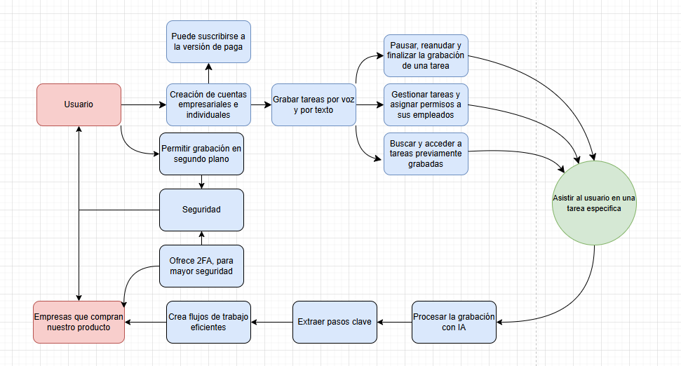

# Entregable-2

Jesus Valverde Ureña - 2022437462 y Ana Hernández Muñoz - 2023057623

### 1. Investigue como realizar un goal map en referencia a técnicas como google sprint o design thinking

### 2.Proceda a crear un goal diagram ubicando el objetivo principal del sistema lo más a la derecha del diagrama y las entidades involucradas a la izquierda. Rellene el workflow del mapa y diagramelo en alguna herramienta que se lo permita.
